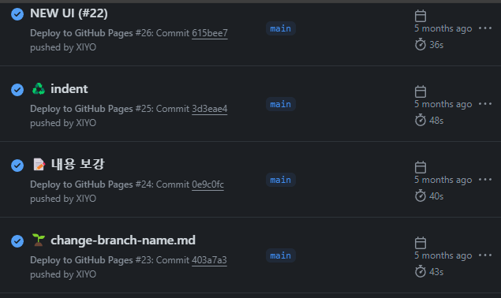
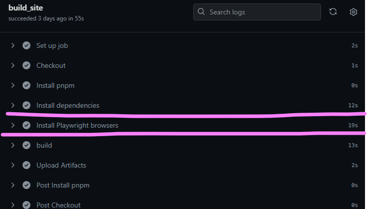

# Using GitHub Action Cache

While using GitHub Actions, I experienced a gradual slowdown in build speed. To improve this, I implemented caching strategies to save time on dependency installation.

## Changes in Build Speed



The initial build speed was quite fast, under 40 seconds. However, over time, the build time increased significantly, especially after adding the Mermaid parser to the Markdown files.


This issue is not solely due to the Mermaid syntax. My blog uses Svelte for pre-rendering, which requires parsing all Markdown files during the initial build.

Moreover, since I wanted the Markdown files to display correctly on GitHub without using front matter, I did not include metadata such as creation or modification dates. To compensate for this, I used the `git log` command to add that data, which increased CPU load and made performance improvement challenging. (Separating this into workers could enhance performance, but it's still a bit beyond my current skill level...)



Ultimately, to optimize the build, I decided to focus on reducing package installation time.

## Modifying the GitHub Workflow

`Initial Workflow` snippet

```yml
jobs:
  build_site:
    runs-on: ubuntu-latest
    steps:
      - name: Checkout
        uses: actions/checkout@v4
        with:
          fetch-depth: 0

      - name: Install pnpm
        uses: pnpm/action-setup@v3
        with:
          version: 8

      - name: Install dependencies
        run: pnpm install

      - name: Install Playwright browsers
        run: pnpm exec playwright install --with-deps chromium

      - name: build
        env:
          BASE_PATH: '/${{ github.event.repository.name }}'
        run: |
          pnpm run build
      - name: Upload Artifacts
        uses: actions/upload-pages-artifact@v3
        with:
          # this should match the `pages` option in your adapter-static options
          path: 'build/'
```

The initial workflow did not utilize caching at all. Since it was my first time using GitHub Actions and Svelte, I was just satisfied with getting the automatic build to work correctly.

`Optimized Workflow` snippet

```diff
jobs:
  build_site:
    runs-on: ubuntu-latest
    steps:
      - name: Checkout
        uses: actions/checkout@v4
        with:
          fetch-depth: 0

      - name: Install pnpm
-       uses: pnpm/action-setup@v3
+       uses: pnpm/action-setup@v4
        with:
-         version: 8
+         run_install: false

+     - name: Install Node.js
+       uses: actions/setup-node@v4
+       with:
+         node-version: 22
+         cache: 'pnpm'  # Enable cache for Node modules (using built-in feature)

      - name: Install dependencies
        run: pnpm install # Cached installation speeds up the process

+     - name: Get installed Playwright version
+       id: playwright-version
+       run: echo "PLAYWRIGHT_VERSION=$(pnpm list @playwright/test --depth=0 | grep @playwright/test | awk '{print $2}')" >> $GITHUB_ENV

+     - name: Cache playwright binaries
+       uses: actions/cache@v4.0.2
+       id: playwright-cache
+       with:
+         path: ~/.cache/ms-playwright
+         key: ${{ runner.os }}-playwright-${{ env.PLAYWRIGHT_VERSION }}

+     - run: pnpx playwright install --with-deps chromium
+       if: steps.playwright-cache.outputs.cache-hit != 'true'

      - name: build
        env:
          BASE_PATH: '/${{ github.event.repository.name }}'
        run: |
          pnpm run build
      - name: Upload Artifacts
        uses: actions/upload-pages-artifact@v3
        with:
          # this should match the `pages` option in your adapter-static options
          path: 'build/'
```

The key to this optimized code is the effective use of caching.

The Node.js module cache is activated by setting the `cache: pnpm` option provided by `actions/setup-node@v4`. While there is a way to manually store the cache, I determined that utilizing the built-in abstracted option is more efficient.

In particular, I cached `playwright`, which was a major cause of the slowdown, minimizing installation time. If the cache already exists, the installation step can be skipped, further optimizing build time.

> \[!note]
> The Playwright version extraction feature in the code above is specific to the pnpm package. If you are using a different package manager, please refer to the appropriate code...🥲

## Changes in Build Speed


While the build speed did not improve dramatically, I achieved a satisfactory result through appropriate optimization.

### Additional Optimization Strategies

Here are a few more optimization methods to consider:

- Parallel execution
- Using custom runners to utilize custom containers
- Integrating all processes into a single workflow

