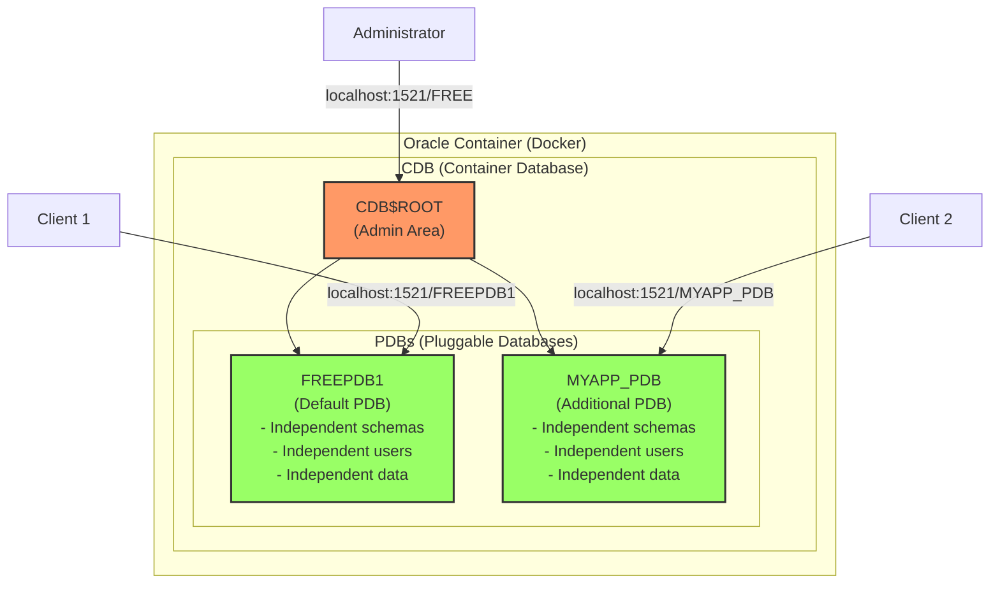

# Oracle Database Concepts Guide

## What is Oracle?

Oracle originally refers to the company name, but Oracle Database became so famous that "Oracle" generally became synonymous with Oracle Database.

### Major Oracle Corporation Products

- **Oracle Database**: Relational Database Management System (RDBMS)
- **Oracle Linux**: Enterprise Linux operating system
- **Java**: Programming language and platform
- **MySQL**: Open source database
- **VirtualBox**: Virtualization software
- **WebLogic Server**: Application server

## What is Container Registry?

Container Registry is a repository for storing and distributing Docker images:
- **Docker Hub**: Docker's official public registry (hub.docker.com)
- **Private Registry**: Private registry operated by companies
- **Cloud Registry**: AWS ECR, Google GCR, Azure ACR, etc.

When downloading images:
```bash
docker pull nginx # Docker Hub (default)
docker pull gcr.io/project/image # Google Container Registry
docker pull container-registry.oracle.com/database/free # Oracle Container Registry
```

### Why Oracle Uses Its Own Container Registry

Oracle operates its own Container Registry, which comes with certain restrictions:
- License management and terms of service agreement required
- Enterprise Edition requires commercial license verification
- Policies for security and support services

While this reduces accessibility, it provides an official support channel for enterprise customers.

> [!WARNING]
> Searching for "oracle" on Docker Hub only shows Oracle Linux images.
> Oracle Database images are not on Docker Hub, so be careful.
> Oracle Database is officially provided only through Oracle Container Registry.

## Oracle Database Edition Comparison

Oracle Database is available in several editions, each with different limitations.

### Express Edition (XE)
- **Free** to use
- CPU: Maximum 2 cores
- Database size: Maximum 12GB
- RAM: Maximum 2GB
- Suitable for development and learning

### Free Edition (23c)
- **Free** to use (released in 2023)
- More features than XE
- CPU: Maximum 2 threads
- Memory: Maximum 2GB SGA + 2GB PGA
- User data: Maximum 12GB
- Latest version for developers, intended to replace XE

> [!TIP]
> For new projects, it's better to use Free Edition rather than XE.
> Use XE only when legacy system compatibility is required, otherwise choose Free Edition with the latest features.

### Standard Edition 2 (SE2)
- **Commercial license required**
- For small to medium enterprises
- CPU: Supports up to 2 sockets only
- No RAC (Real Application Clusters) support
- Limited advanced security features
- Cheaper license than Enterprise Edition

> [!INFO]
> Oracle operated a complex version scheme for Standard Edition:
> - **SE**: Supports up to 4 sockets
> - **SE1**: Supports up to 2 sockets (cheaper version)
> - **SE2**: Merged SE and SE1 in 2015
> 
> Currently only SE2 is available for purchase, and existing licenses are converted to SE2.

### Enterprise Edition (EE)
- **Commercial license required** (most expensive license)
- For large enterprises
- All features available
- No limitations
- Includes advanced features like RAC, Partitioning, Advanced Security

> [!INFO]
> Oracle Enterprise Edition is an expensive commercial license starting from tens of thousands of dollars minimum.
> Due to this high barrier to entry, many companies choose open-source alternatives like PostgreSQL or MySQL.

## Oracle Core Concepts

### Service Name vs SID

**SID (System Identifier)**
- Unique identifier for a database instance
- Traditional method used since before Oracle 8i
- Directly specifies one instance
- Example: `free`, `XE`, `ORCL`

**Service Name**
- Logical name introduced from Oracle 8i
- Can refer to one or more instances (useful in cluster environments)
- More flexible and modern connection method
- Example: `FREEPDB1`, `myapp.example.com`

**What does Service Name point to?**
- Service Name is not the database itself but **a path to connect to the database**
- It's not a schema (schema is a collection of user account and its objects)
- Simply put, it's like a "phone number" for the database
- One database can have multiple Service Names

**The isolated space is PDB**
- **PDB (Pluggable Database)**: Isolated independent database space
- **Service Name**: A label to connect to PDB
- Example: `FREEPDB1` is both a Service Name and PDB name
- Each PDB is isolated from others and operates independently

> [!TIP]
> Latest Oracle recommends using Service Name.
> In connection strings, SID uses `:SID` format, Service Name uses `/SERVICE_NAME` format.

### CDB/PDB Architecture

PDB (Pluggable Database) is a core concept of the multitenant architecture introduced from Oracle 12c.

- **CDB (Container Database)**: Root container that manages everything
- **PDB (Pluggable Database)**: Independent database actually used by applications

Simply put, CDB is like an apartment building and PDB is like each unit. Actual work is done in PDB.

> [!NOTE]
> Oracle Free provides one PDB called FREEPDB1 by default.
> You can create additional PDBs if needed, and each PDB is completely isolated and operates independently.



> [!INFO]
> **Comparison with other databases**
> - Oracle PDB ≈ PostgreSQL Database
> - Oracle User ≈ PostgreSQL Schema
> - Oracle CDB ≈ PostgreSQL Cluster
> 
> Just like `CREATE DATABASE myapp` in PostgreSQL,
> Oracle uses `CREATE PLUGGABLE DATABASE myapp_pdb`.

### Oracle's Unique Schema Concept

**Oracle's peculiar schema concept:**
Oracle has schemas, but they work uniquely:
- **Oracle schema**: Object collection mapped 1:1 with User
- When a User is created, a schema with the same name is automatically created
- Schema is a logical container for all objects (tables, views, indexes, etc.) owned by that User
- CREATE SCHEMA command exists, but schemas are actually created automatically when creating Users

**PostgreSQL/MySQL schemas:**
```sql
-- PostgreSQL: Can create multiple Schemas within a Database
CREATE SCHEMA sales;
CREATE SCHEMA hr;
CREATE TABLE sales.orders (...);  -- Create table in sales schema
CREATE TABLE hr.employees (...);   -- Create table in hr schema
```

**Oracle schemas:**
```sql
-- Oracle: Schema is automatically created when User is created
CREATE USER sales IDENTIFIED BY password;
CREATE USER hr IDENTIFIED BY password;
-- When logged in as sales user, work in sales schema
-- When logged in as hr user, work in hr schema
```

**Key differences:**
- **Other DBs**: Schema is a logical namespace for grouping tables
- **Oracle**: Schema exists but cannot be separated from User (User = Schema Owner)
- **Other DBs**: One user can create/own multiple schemas
- **Oracle**: One user = One schema (fixed 1:1 relationship)

**Note: User creation ≠ PDB creation**
```sql
-- Create User within PDB (new schema within same PDB)
CREATE USER student IDENTIFIED BY pass123;  -- Create student schema in FREEPDB1
CREATE USER teacher IDENTIFIED BY pass456;  -- Create teacher schema in FREEPDB1

-- All within the same FREEPDB1! Not creating new PDB
-- PDB is created only with CREATE PLUGGABLE DATABASE
```

**Why User = Schema in Oracle:**
```sql
-- When logged in as student
CREATE TABLE scores (id NUMBER);  -- Creates student.scores table

-- When logged in as teacher
CREATE TABLE classes (id NUMBER); -- Creates teacher.classes table

-- To access other user's tables
SELECT * FROM student.scores;     -- teacher queries student's table
```

In Oracle, when you create a user, a schema with the same name as that user is automatically created.
This schema is the space that contains all objects (tables, views, etc.) created by that user.

### User Permission System

**User permission system within PDB:**
```sql
-- Regular user: Works only in their own schema
CREATE USER student IDENTIFIED BY pass123;
GRANT CREATE SESSION, CREATE TABLE TO student;

-- DBA permission user: Manages entire PDB
CREATE USER pdb_admin IDENTIFIED BY admin123;
GRANT DBA TO pdb_admin;  -- All permissions within PDB

-- Grant access to other schemas
GRANT SELECT ON student.scores TO teacher;  -- teacher can query student.scores
```

**User types:**
- **Regular user**: Works only in their own schema (default)
- **DBA permission user**: Access/manage all schemas within PDB (Database Administrator)
- **SYS/SYSTEM**: Manage CDB and all PDBs (highest permission)

**Meaning of DBA permission:**
- DBA = Database Administrator
- `GRANT DBA TO user` means "make this user an administrator"
- Can perform almost all operations within PDB (create/drop tables, manage users, backup, etc.)
- However, cannot access other PDBs (independent administrator per PDB)

> [!NOTE]
> **Oracle Terminology Characteristics**
> 
> Oracle uses its own terminology system:
> - Introduced CDB/PDB concepts for multitenant architecture (from 12c)
> - Evolved from traditional single instance structure to cloud era
> - High learning curve but useful features for large enterprise environments
> 
> However, for small projects, consider simpler alternatives like PostgreSQL.

## Connection Information

### Oracle Database 23c Free Connection Information
- **SID**: free (lowercase)
- **Service Name (CDB)**: FREE - For connecting to root container
- **Service Name (PDB)**: FREEPDB1 - For connecting to actual database

Applications typically connect to the PDB, FREEPDB1.
Connection string example: `username/password@hostname:1521/FREEPDB1`

### Loss Leader Strategy

> [!INFO]
> Most Container Registries require login before downloading images.
> However, Oracle allows downloading Free Edition without login by using it as a "loss leader" product.
> Enterprise Edition and Standard Edition still require Oracle account login.