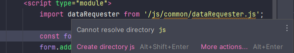

# Resolving Static Resource Recognition Issues in IntelliJ for HTML

This guide addresses the issue of IntelliJ not recognizing JavaScript files as static resources in the HTML of a Spring Boot project.

When writing code, it can be inconvenient if IntelliJ fails to recognize JavaScript files. While this issue does not affect the actual execution of the application, it can lead to errors during coding, making it necessary to resolve.

## Cause

When importing JavaScript files into HTML in a Spring Boot project, there is a problem with IntelliJ not correctly locating the path to the JavaScript files. This is due to the resource directory settings in IntelliJ.

## Solution

Add the `src/main/resources/static` directory as a resource in the **Project Structure** window of IntelliJ.

> **Tip**
>
> You can open the **Project Structure** window by pressing <kbd>Ctrl</kbd> + <kbd>Alt</kbd> + <kbd>Shift</kbd> + <kbd>S</kbd>.

