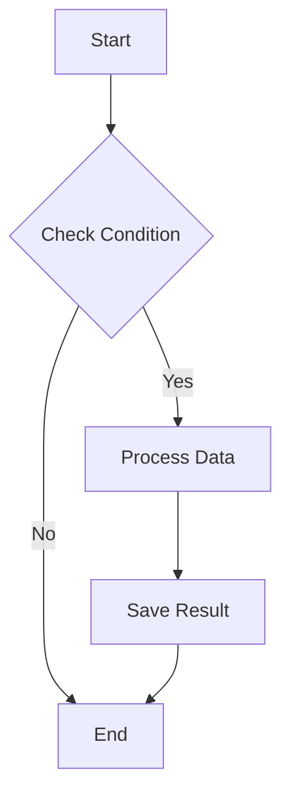
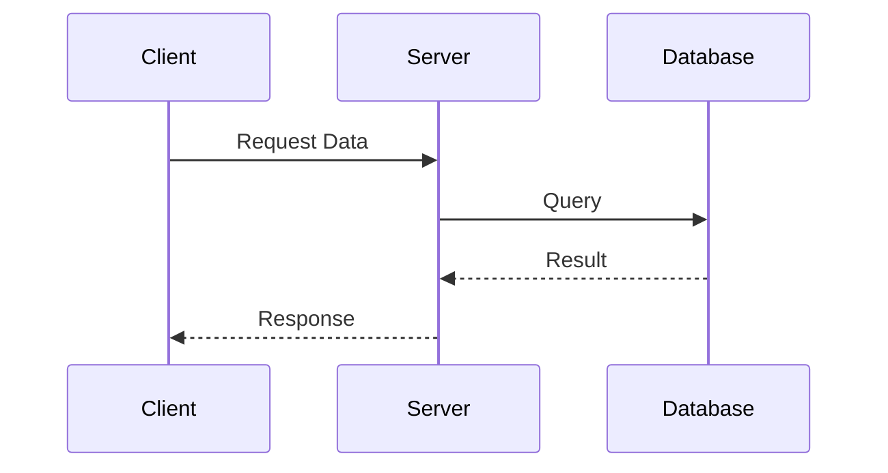
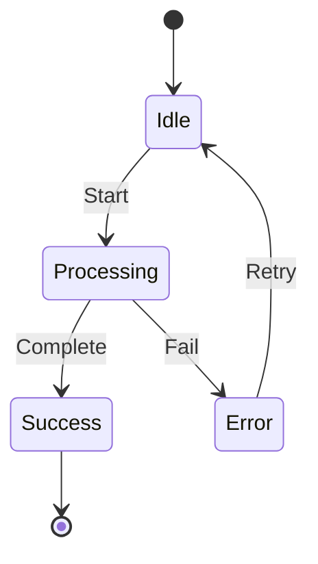
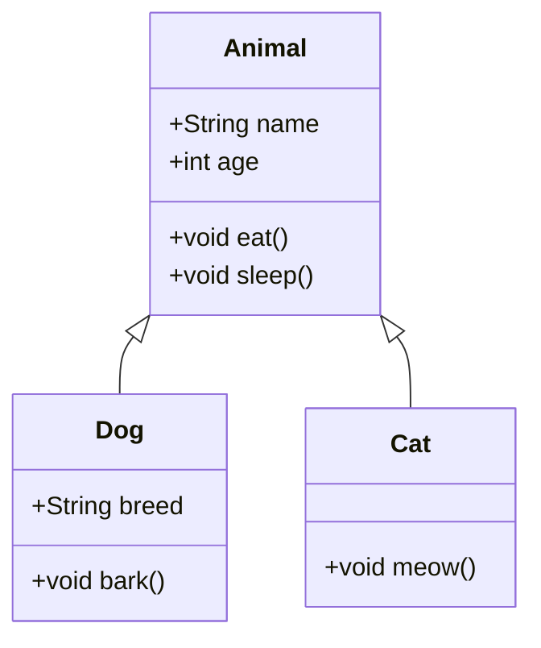

# Obsidian Basic Markdown Features

> [!NOTE]
> These are code block features that can be used natively in Obsidian without plugins.

## Programming Language Code Blocks

### Java
```java
public class HelloWorld {
    public static void main(String[] args) {
        System.out.println("Hello, Obsidian!");
        // This is a comment
    }
}
```

### Python
```python
def fibonacci(n):
    if n <= 1:
        return n
    return fibonacci(n-1) + fibonacci(n-2)

# Generate fibonacci sequence
result = [fibonacci(i) for i in range(10)]
print(result)
```

### JavaScript
```javascript
const fetchData = async (url) => {
    try {
        const response = await fetch(url);
        return await response.json();
    } catch (error) {
        console.error('Error:', error);
    }
};
```

### SQL
```sql
SELECT
    u.name,
    COUNT(o.id) as order_count,
    SUM(o.total) as total_spent
FROM users u
LEFT JOIN orders o ON u.id = o.user_id
WHERE o.created_at >= '2024-01-01'
GROUP BY u.id, u.name
ORDER BY total_spent DESC;
```

## Mermaid Diagrams (Native Support)

### Flowchart


### Sequence Diagram


### State Diagram


### Class Diagram


## Mathematical Formulas (LaTeX)

### Inline Math
The solution to the quadratic equation $ax^2 + bx + c = 0$ is $x = \frac{-b \pm \sqrt{b^2-4ac}}{2a}$.

### Block Math
Probability density function of normal distribution:
$$
f(x) = \frac{1}{\sigma\sqrt{2\pi}} e^{-\frac{1}{2}\left(\frac{x-\mu}{\sigma}\right)^2}
$$

Fourier transform:
$$
\hat{f}(\xi) = \int_{-\infty}^{\infty} f(x) e^{-2\pi i x \xi} dx
$$

## Tables (Basic Markdown)

| Method | Time Complexity | Space Complexity |
|--------|----------------|------------------|
| Bubble Sort | O(n²) | O(1) |
| Quick Sort | O(n log n) | O(log n) |
| Merge Sort | O(n log n) | O(n) |
| Heap Sort | O(n log n) | O(1) |

## Checklists

Project Progress:
- [x] Requirements Analysis
- [x] Database Design
- [ ] API Development
  - [x] User Authentication
  - [ ] Data CRUD Operations
  - [ ] File Upload
- [ ] Frontend Development
- [ ] Testing
- [ ] Deployment

## Callout Boxes

> [!NOTE]
> Used to convey basic information.

> [!TIP]
> Provides useful tips or recommendations.

> [!WARNING]
> Emphasizes important considerations.

> [!DANGER]
> Warns of serious issues or dangers.

> [!INFO]
> Provides additional background information.

> [!SUCCESS]
> Indicates successful completion.

> [!QUESTION]
> Presents questions or considerations.

> [!ABSTRACT]
> Displays summaries or overviews.

## Quotes and Emphasis

### Quotes
> "The only way to do great work is to love what you do."
> — Steve Jobs

### Nested Quotes
> First level
>> Second level
>>> Third level

### Text Emphasis
- **Bold text** or __bold text__
- *Italic* or _italic_
- ***Bold italic*** or ___bold italic___
- ~~Strikethrough~~
- ==Highlight== (Obsidian only)

## Lists

### Ordered Lists
1. First item
2. Second item
   1. Sub-item 2.1
   2. Sub-item 2.2
3. Third item

### Unordered Lists
- Main point
  - Sub point
    - Sub-sub point
  - Another sub point
- Another main point

## Horizontal Rules

Three or more hyphens, asterisks, or underscores:

---

***

___

## Images and Links

### Links
[Obsidian Official Site](https://obsidian.md)

### Images


### Image Size Adjustment (Obsidian Only)


> [!TIP]
> These basic features alone are enough to create rich documents!

## Next Steps

After mastering markdown features:
- [Sync Settings](step-01.md) - Use notes across multiple devices